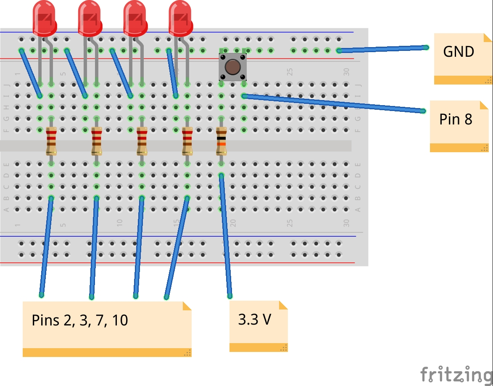
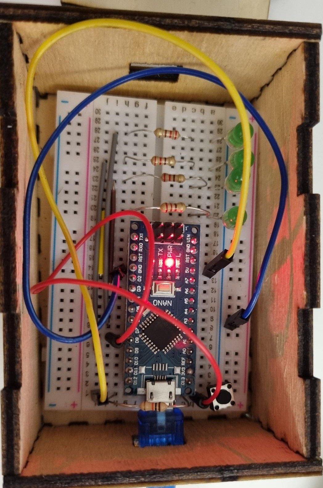

# AdventBox

Ein Projekt des [CoderDojo Potsdam](https://coderdojopotsdam.github.io/) zum gemeinsamen Basteln und Programmieren in der Adventszeit.

Die Box bietet eine Verkleidung für einen eigenen elektrischen Adventskranz.
Die vier Kerzen des Adventskranzes lassen sich mittels des Tasters nacheinander anschalten.
Auch wenn der Arduino vom Strom genommen wurde und wieder angesteckt wird, ist wieder die gleiche Anzahl Kerzen an.

## Materialien

- Arduino Nano oder ähnlicher Microcontroller
- 1 Breadboard
- 4 LED in der Farbe eurer Wahl
- 4 Widerstände 220 Ohm
- 1 Taster
- 1 Widerstand 10 kOhm
- diverse Jumperkabel
- Holz und Acryl für die Box

## Anleitung

1. Zuerst baust du aus [Holz](kasten.svg) und [Acryl](kerzen.svg) die Box eures Adventskranzes.
2. Verbinde zunächst eine LED mit einem Widerstand und deinem Arduino. Lasse die LED blinken und überprüfe so, dass du deinen Arduino ansteuern kannst und alles funktioniert.
3. Nun steckt ihr nach Schaltplan (siehe unten) auf dem Breadboard alle Komponenten zusammen.

|||
|--|--|
| Schaltung logisch auf dem Breadboard | So könnte das fertige Steckbild in Wirklichkeit aussehen |

4. Für den Code gibt zwei Schwierigkeitsstufen: Nun kannst du entweder den leeren Programmrahmen aus dem Ordner `AdventWreathEmpty` oder den fertigen Code aus dem Ordner `AdventWreathComplete` auf deinen Arduino hochladen
5. Für den letzten Schliff: Macht einen 3D-Druck vom [Adventskranz](kranz.stl) um die LEDs in Form zu halten

## Referenzen

* Schaltung basiert auf Vorlage von [Christian Grieger](https://elektro.turanis.de/html/prj404/index.html)
* Vorlage 3D-gedruckter Kranz: [Betsmo (Thingiverse)](https://www.thingiverse.com/thing:1937138), Lizenz CC-BY

