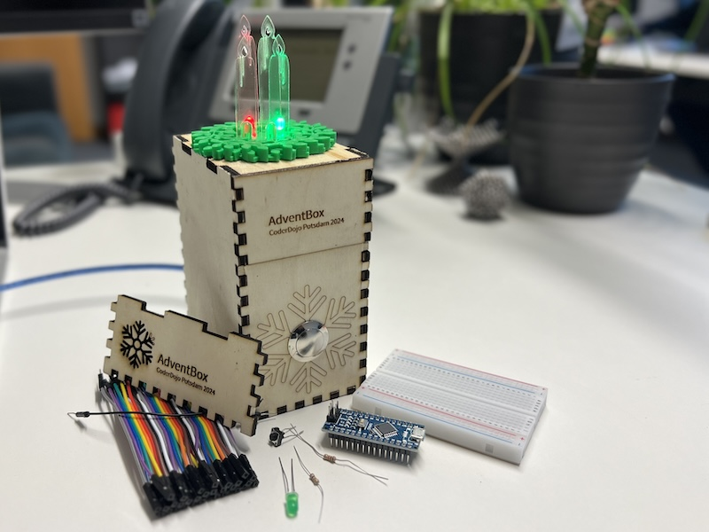

# AdventBox

Ein Projekt des [CoderDojo Potsdam](https://coderdojopotsdam.github.io/) zum gemeinsamen Basteln und Programmieren in der Adventszeit.

Die Box bietet eine Verkleidung für einen eigenen elektrischen Adventskranz.
Die vier Kerzen des Adventskranzes lassen sich mittels des Tasters nacheinander anschalten.

Auch wenn der Arduino vom Strom genommen wurde und wieder angesteckt wird, leuchtet die gleiche Anzahl Kerzen. So kannst du bequem die Wochen bis Weihnachten zählen.

## Materialien

- Arduino Nano oder ähnlicher Microcontroller
- 1 Breadboard
- 4 LEDs in der Farbe eurer Wahl
- 4 Widerstände 220 Ohm
- 1 Widerstand 100 kOhm
- 1 Taster
- diverse Jumperkabel oder Kabelbrücken

Außerdem zur Verschönerung:

- Holz für die Box
- Einen 3D-gedruckten Adventskranz
- Aus Acryl geschnittene Kerzen

## Anleitung

### 1. Ein Testlauf

1. Nimm ein Breadboard und setze den Arduino auf
2. Verbinde Pin D2 mit einem 220 Ohm Vorwiderstand und mit einer LED
3. Verbinde Pin D8 mit dem Taster und dahinter einem 100 kOhm Widerstand
4. Verbinde den Minus-Pol der LED und den 100 kOhm Widerstand mit GND am Arduino
5. Lade den Quellcode [AdventBoxBlink](AdventBoxBlink/) auf den Arduino

Wenn du alles richtig gemacht hast, kannst du abwechselnd die interne LED und externe LED blinken lassen.

### 2. Die vollständige Schaltung

1. Füge drei weitere LEDs mit 220 Ohm Vorwiderständen hinzu.
2. Stell sicher, dass die Plus-Pole der LEDs an die Pins D2, D3, D7 und D10 angeschlossen sind
3. Die Minuspole kannst du auf den gemeinsamen Pin GND ziehen.
4. Lade den Quellcode [AdventBoxCode](AdventBoxCode/) auf den Arduino
  * Alternativ kannst du versuchen das Programm selbst zu schreiben. Beginn mit [AdventBoxEmpty](AdventBoxEmpty/). Die Anzahl der leuchtenden Kerzen kannst du im [EEPROM](https://docs.arduino.cc/learn/built-in-libraries/eeprom/) speichern, damit sie auch bei getrennten Strom gespeichert werden.

Wenn du alles richtig gemacht hast, kannst du reihum die externen LEDs aufleuchten lassen.

### 3. Bau die Box

Fertige folgende Materialien an, oder frage die Mentor:innen danach:

1. Schneide mit dem Lasercutter die [Holzteile der Box](Lasercuttervorlagen/kasten_schnitt.02mm.svg).
2. Schneide mit dem Lasercutter zwei lange und zwei kurze [Kerzen aus Acryl](Lasercuttervorlagen/kerzen.svg)
3. Drucke mit dem 3D-Drucker den [Kranz](kranz.stl) aus.
4. Bau die Box bis auf ein Seitenteil zusammen, sodass du bequem deine Schaltung in die Box setzen kannst.
5. Setz das Breadboard mit Arduino, Widerständen und Kabeln in die Box.
6. Verlängere die Anschlüsse der LEDs mit Jumperkabeln.
6. Fädle die Kabel zu den LEDs durch die großen Löcher im Adventskranz und steck die LEDs ein.
7. Schließe den Knopf an und teste deine Schaltung erneut.
8. Schließ die Kiste und setze die Kerzen in die kleinen Löcher auf deinen Kranz.

**Frohen Advent!**

## Referenzen

* Schaltung basiert auf Vorlage von [Christian Grieger](https://elektro.turanis.de/html/prj404/index.html)
* Vorlage 3D-gedruckter Kranz: [Betsmo (Thingiverse)](https://www.thingiverse.com/thing:1937138), Lizenz CC-BY

